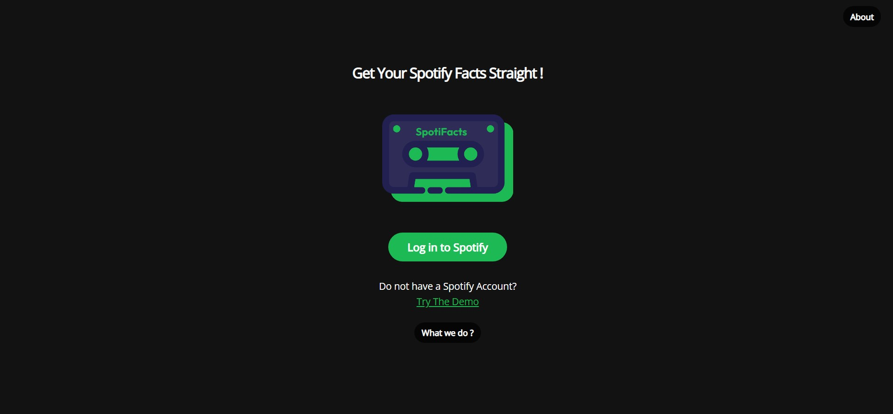
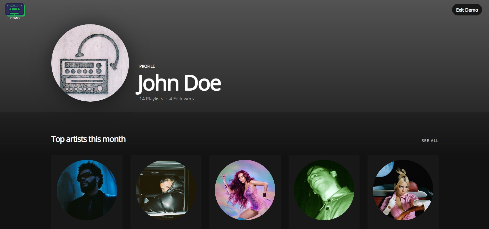
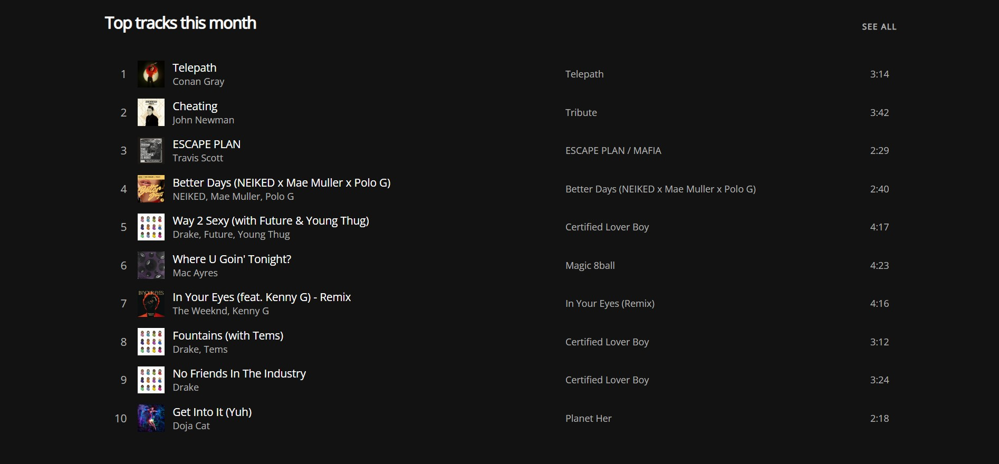
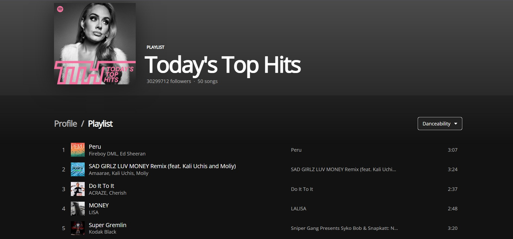

<h2>SpotiFacts (https://spotifacts.vercel.app/) </h2> 

  </img>

SpotiFacts is a react web app that uses Spotify API to give the app
users and enhanced and in-depth overview of their profile and listening
habits. For now the app provides you a detail view of your tracks and
artists that you have been to the most past month, 6 months and a year.
Furthermore, explore your playlist collection to find songs sorted by
danceability and tempo. Login with your Spotify or try the demo.

**Take a dive into the app:**

<https://spotifacts.vercel.app/>

**Some Screenshots**

   

   

   

Find the source code at:

Front-End: <https://github.com/jatinAroraGit/spotifacts-app>

Back-End: <https://github.com/jatinAroraGit/spotifacts-api>

Built Using React, JavaScript and Express JS.

Code and project is not available to copy, reproduce, share or modify in any form. Any mention or description of this website or source code must be attributed to Jatin Arora
